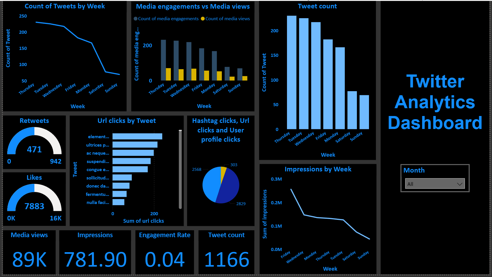

**# Twitter Analytics Dashboard (Power BI) **#

# Project Overview

This project is an interactive Power BI dashboard developed to analyze Twitter engagement metrics and tweet performance.

The repository currently contains the Power BI template (.pbit). Dashboard screenshots and additional documentation will be added soon.

## Features

- Interactive Power BI dashboard
- KPI Cards
- DAX Measures
- Power Query Transformations
- Interactive Filters and Slicers

## Tools Used

- Power BI
- DAX
- Power Query

## Key Insights

This dashboard provides insights into:

- Weekly tweet performance
- User engagement trends
- Media views and media engagements
- URL, hashtag, and profile click analysis
- Total impressions and engagement rate
- Tweet activity across different weekdays

## Dashboard Preview

